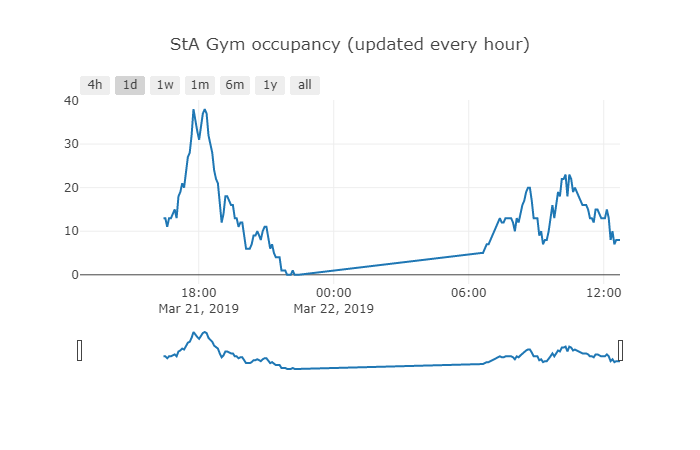

# gym-occupancy-tracker

Basic gym occupancy tracker and plotter for University of St Andrews sport centre

## How

- It crawls the sport centre's website and capture the occupancy percentage every 5 minutes and stores in json.

```
...
{"hr_t": "2019-03-22 12:13:23", "p": 13}
{"hr_t": "2019-03-22 12:18:24", "p": 8}
{"hr_t": "2019-03-22 12:23:24", "p": 10}
...
```

- It generates/updates an offline plot every hour. 



## Python Requirements

- requests
- pandas
- plotly

## Online

An online version should be available at gokberkkocak.com/gym.s